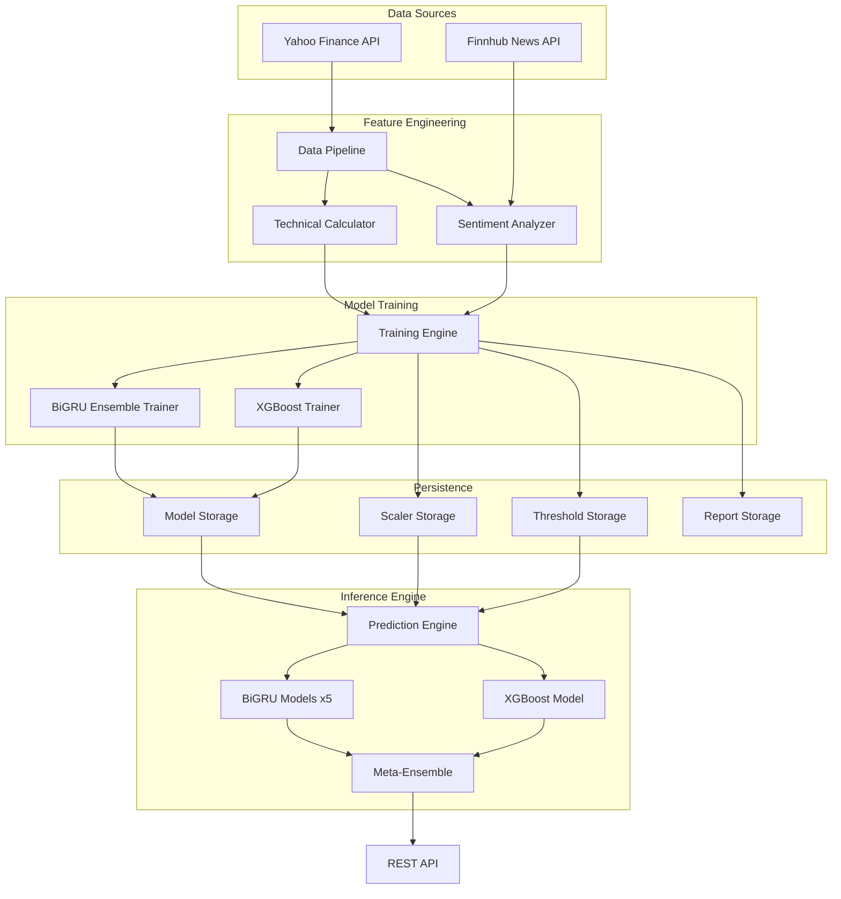

# Design Document: Sentiment-Enhanced Prediction

## Overview

El sistema Horizon actualmente utiliza un ensemble de modelos BiGRU bidireccionales para predecir tendencias de activos financieros a 5 días, alcanzando un accuracy del ~50% (equivalente a predicción aleatoria). Este diseño describe la integración completa de análisis de sentimiento de noticias financieras y la optimización del meta-ensemble híbrido (BiGRU + XGBoost) para superar significativamente el baseline actual.

### Objetivos del Diseño

1. **Integración de Señales Fundamentales**: Incorporar análisis de sentimiento de noticias como features adicionales en el pipeline de predicción
2. **Optimización del Meta-Ensemble**: Combinar inteligentemente predicciones de BiGRU (análisis de series temporales) y XGBoost (clasificación tabular) con pesos adaptativos
3. **Robustez Operacional**: Garantizar funcionamiento continuo ante fallos de APIs externas
4. **Interpretabilidad**: Proporcionar transparencia sobre factores que influyen en las predicciones

### Alcance

**Incluido:**
- Módulo de análisis de sentimiento con FinBERT y Finnhub API
- Pipeline de features técnicas + sentimiento
- Meta-ensemble con pesos configurables
- Sistema de threshold dinámico basado en datos históricos
- Persistencia y versionado de modelos
- Métricas de evaluación completas

**Excluido:**
- Reentrenamiento automático periódico (se mantiene entrenamiento manual)
- Análisis de sentimiento de redes sociales (solo noticias financieras)
- Optimización automática de hiperparámetros (se mantiene configuración manual)

## Architecture

### Diagrama de Arquitectura del Sistema



### Flujo de Datos

**Entrenamiento:**
1. Descarga de datos históricos (Yahoo Finance)
2. Cálculo de features técnicas (RSI, MACD, Bollinger, ATR, etc.)
3. Obtención de noticias y análisis de sentimiento (Finnhub + FinBERT)
4. Combinación de features técnicas + sentimiento
5. Normalización con StandardScaler
6. Entrenamiento de ensemble BiGRU (5 modelos con variaciones)
7. Entrenamiento de XGBoost con último timestep
8. Cálculo de threshold dinámico (percentil 60 de retornos absolutos)
9. Persistencia de modelos, scaler, threshold y métricas

**Inferencia:**
1. Descarga de datos recientes del ticker
2. Cálculo de features técnicas
3. Obtención de sentimiento de últimos 7 días
4. Normalización con scaler guardado
5. Predicción con cada modelo BiGRU (retornos logarítmicos)
6. Predicción con XGBoost (dirección binaria + probabilidad)
7. Combinación en meta-ensemble con pesos configurables
8. Clasificación de tendencia final (ALCISTA/BAJISTA/LATERAL)
9. Cálculo de bandas de incertidumbre

## Components and Interfaces

### 1. Sentiment Analyzer Module

**Responsabilidad:** Obtener y analizar sentimiento de noticias financieras.

**Componentes:**
- `_get_finbert()`: Carga singleton de FinBERT (ProsusAI/finbert) en CPU
- `_get_finnhub_client()`: Inicialización de cliente Finnhub con API key
- `_analyze_headlines(headlines: list) -> (score, magnitude)`: Análisis de titulares con FinBERT
- `compute_historical_sentiment(ticker, start_date, end_date) -> DataFrame`: Features de sentimiento histórico
- `get_daily_sentiment(ticker, days_back=7) -> dict`: Sentimiento agregado para inferencia

**Interfaz Pública:**

```python
def compute_historical_sentiment(
    ticker: str,
    start_date: str,  # 'YYYY-MM-DD'
    end_date: str,
) -> pd.DataFrame:
    """
    Returns:
        DataFrame con índice de fechas (días hábiles) y columnas:
        - sentiment_score: float [-1.0, +1.0]
        - sentiment_magnitude: float [0.0, 1.0]
        - news_volume: int >= 0
    """

def get_daily_sentiment(ticker: str, days_back: int = 7) -> dict:
    """
    Returns:
        {
            "sentiment_score": float,
            "sentiment_magnitude": float,
            "news_volume": int,
            "available": bool
        }
    """
```

**Manejo de Errores:**
- Si `FINNHUB_API_KEY` no está configurada → valores neutros (0.0, 0.0, 0)
- Si descarga de noticias falla → warning + valores neutros
- Si FinBERT no puede cargarse → warning + valores neutros
- Truncamiento de titulares a 512 caracteres para evitar errores de tokenización

**Estrategia de Fallback:**
- Forward-fill limitado a 5 días para fechas sin noticias
- Valores neutros para fechas históricas sin datos (tier gratuito de Finnhub)

### 2. Feature Pipeline

**Responsabilidad:** Calcular y combinar features técnicas y de sentimiento.

**Componentes:**
- `download_data(ticker) -> DataFrame`: Descarga datos de Yahoo Finance
- `compute_features(df, include_market_context, ticker) -> DataFrame`: Calcula indicadores técnicos
- `prepare_data(ticker, config) -> dict`: Pipeline completo de preparación
- `prepare_data_multi_window(ticker, config, window_sizes) -> dict`: Optimización para múltiples ventanas

**Features Técnicas Base (9):**
- Close, Volume, RSI, MACD, EMA, Bollinger_PctB, ATR, Log_Return, Volume_Ratio

**Features Adicionales para Volátiles (2):**
- VIX_Close, NASDAQ_Return

**Features de Sentimiento (3):**
- sentiment_score, sentiment_magnitude, news_volume

**Configuración Adaptativa:**
```python
def get_feature_cols(ticker: str) -> list:
    """
    Activos estables:
        - Sin sentimiento: 9 features
        - Con sentimiento: 12 features
    
    Activos volátiles:
        - Sin sentimiento: 11 features (9 base + 2 contexto)
        - Con sentimiento: 14 features (11 + 3 sentimiento)
    """
```

**Interfaz de Datos:**

```python
def prepare_data(ticker: str, config: dict) -> dict:
    """
    Returns:
        {
            "X_train": torch.Tensor [n_train, window_size, n_features],
            "y_train": torch.Tensor [n_train, 1],
            "X_val": torch.Tensor [n_val, window_size, n_features],
            "y_val": torch.Tensor [n_val, 1],
            "X_test": torch.Tensor [n_test, window_size, n_features],
            "y_test": torch.Tensor [n_test, 1],
            "scaler": StandardScaler (fitted),
            "dynamic_threshold": float,
            "feature_cols": list[str]
        }
    """
```

### 3. BiGRU Ensemble

**Responsabilidad:** Ensemble de 5 modelos BiGRU con variaciones de hiperparámetros.

**Arquitectura de Modelo Individual:**

```python
class HorizonBiGRU(nn.Module):
    def __init__(self, input_dim, hidden_dim, num_layers, dropout):
        self.bigru = nn.GRU(
            input_dim, 
            hidden_dim, 
            num_layers, 
            batch_first=True, 
            bidirectional=True,
            dropout=dropout if num_layers > 1 else 0
        )
        self.fc = nn.Linear(hidden_dim * 2, 1)  # *2 por bidireccional
    
    def forward(self, x):
        # x: [batch, window_size, n_features]
        out, _ = self.bigru(x)
        last_hidden = out[:, -1, :]  # último timestep
        return self.fc(last_hidden)  # retorno logarítmico
```

**Variaciones del Ensemble:**

Para activos estables:
```python
[
    {"hidden_dim": 64, "window_size": 30, "dropout": 0.10, "num_layers": 2},
    {"hidden_dim": 48, "window_size": 30, "dropout": 0.15, "num_layers": 2},
    {"hidden_dim": 80, "window_size": 30, "dropout": 0.05, "num_layers": 2},
    {"hidden_dim": 64, "window_size": 20, "dropout": 0.10, "num_layers": 2},
    {"hidden_dim": 64, "window_size": 40, "dropout": 0.20, "num_layers": 3},
]
```

Para activos volátiles:
```python
[
    {"hidden_dim": 64, "window_size": 60, "dropout": 0.30, "num_layers": 2},
    {"hidden_dim": 48, "window_size": 60, "dropout": 0.35, "num_layers": 2},
    {"hidden_dim": 80, "window_size": 60, "dropout": 0.25, "num_layers": 2},
    {"hidden_dim": 64, "window_size": 45, "dropout": 0.30, "num_layers": 2},
    {"hidden_dim": 64, "window_size": 75, "dropout": 0.30, "num_layers": 3},
]
```

**Estrategia de Agregación:**
- Pesos basados en val_loss: `weight_i = (1 / val_loss_i) / sum(1 / val_loss_j)`
- Retorno ponderado: `mean_return = sum(weight_i * return_i)`
- Tendencia por modelo: `return > threshold → ALCISTA, return < -threshold → BAJISTA, else → LATERAL`
- Tendencia final: voto mayoritario ponderado
- Confianza: proporción de peso acumulado en tendencia ganadora

### 4. XGBoost Classifier

**Responsabilidad:** Clasificador binario de dirección del precio.

**Arquitectura:**
- Entrada: último timestep de la ventana (features raw, sin secuencia)
- Salida: probabilidad de subida [0.0, 1.0]
- Etiquetas: 1 si retorno > 0, 0 en caso contrario

**Configuración:**
```python
XGBOOST_CONFIG = {
    "n_estimators": 300,
    "max_depth": 6,
    "learning_rate": 0.05,
    "subsample": 0.8,
    "colsample_bytree": 0.8,
    "early_stopping_rounds": 20,
}
```

**Interfaz:**

```python
def train_xgboost(ticker: str, data: dict, feature_cols: list) -> dict:
    """
    Returns:
        {
            "xgb_directional_accuracy": float,
            "xgb_precision_up": float,
            "xgb_recall_up": float,
            "feature_importance": dict[str, float]
        }
    """

def predict_xgboost(ticker: str, features: np.ndarray) -> dict:
    """
    Returns:
        {
            "direction": int (0 o 1),
            "probability": float [0.0, 1.0]
        }
    """
```

### 5. Meta-Ensemble

**Responsabilidad:** Combinar predicciones de BiGRU y XGBoost con pesos adaptativos.

**Algoritmo:**

```python
# 1. Convertir retorno BiGRU a probabilidad
bigru_prob = sigmoid(mean_return * META_ENSEMBLE_SIGMOID_SCALE)

# 2. Obtener probabilidad XGBoost
xgb_prob = predict_xgboost(ticker, last_features)["probability"]

# 3. Combinar con pesos configurables
w_bigru = META_ENSEMBLE_WEIGHTS["bigru"]  # default: 0.6
w_xgb = META_ENSEMBLE_WEIGHTS["xgboost"]  # default: 0.4
final_score = w_bigru * bigru_prob + w_xgb * xgb_prob

# 4. Clasificar tendencia con zona neutral
delta = META_ENSEMBLE_TREND_DELTA  # default: 0.05
if final_score > 0.5 + delta:
    meta_trend = "ALCISTA"
elif final_score < 0.5 - delta:
    meta_trend = "BAJISTA"
else:
    meta_trend = "LATERAL"
```

**Hiperparámetros:**

- `META_ENSEMBLE_WEIGHTS`: Pesos de combinación (deben sumar 1.0)
  - `bigru`: 0.6 (default) - peso del ensemble BiGRU
  - `xgboost`: 0.4 (default) - peso del clasificador XGBoost

- `META_ENSEMBLE_SIGMOID_SCALE`: 50.0 (default)
  - Factor de escala para conversión de retorno a probabilidad
  - Valor 50 mapea retorno ±2% a probabilidades ~0.73/0.27
  - Mayor valor → mayor sensibilidad a cambios pequeños

- `META_ENSEMBLE_TREND_DELTA`: 0.05 (default)
  - Semi-anchura de zona neutral
  - Delta 0.05 → banda [0.45, 0.55] clasificada como LATERAL
  - Mayor delta → más predicciones LATERAL (conservador)

**Justificación del Diseño:**
- BiGRU captura patrones temporales complejos pero puede sobreajustar
- XGBoost es robusto para clasificación tabular y proporciona feature importance
- Combinación ponderada aprovecha fortalezas de ambos enfoques
- Zona neutral reduce señales falsas en mercados laterales

### 6. Training Pipeline

**Responsabilidad:** Orquestar el entrenamiento completo del sistema.

**Flujo de Entrenamiento:**

```python
def train_ensemble(ticker: str) -> dict:
    """
    1. Determinar tipo de activo (stable/volatile)
    2. Obtener configuración y variaciones de ensemble
    3. Preparar datos históricos UNA VEZ por window_size único
    4. Calcular threshold dinámico (percentil 60 de |retornos|)
    5. Entrenar cada modelo BiGRU con su variación
    6. Evaluar cada modelo en conjunto de test
    7. Calcular pesos del ensemble basados en val_loss
    8. Entrenar XGBoost con mismo dataset
    9. Guardar modelos, scaler, threshold, pesos
    10. Generar informe JSON con métricas completas
    """
```

**Optimización de Datos:**
- `prepare_data_multi_window()` descarga datos UNA VEZ
- Reutiliza datos descargados para todas las variaciones de window_size
- Reduce tiempo de entrenamiento significativamente

**Threshold Dinámico:**
```python
# Calculado sobre conjunto de entrenamiento
abs_returns = np.abs(y_train)
dynamic_threshold = np.percentile(abs_returns, 60)
# Típicamente: 0.01-0.02 para estables, 0.03-0.05 para volátiles
```

**Artefactos Guardados:**
- `{ticker}_model_{idx}.pth`: Pesos de cada modelo BiGRU
- `{ticker}_scaler.pkl`: StandardScaler ajustado
- `{ticker}_threshold.pkl`: Threshold dinámico
- `{ticker}_weights.pkl`: Pesos del ensemble (basados en val_loss)
- `{ticker}_xgboost.pkl`: Modelo XGBoost entrenado
- `{ticker}_report.json`: Informe completo con métricas y configuración

### 7. Prediction Service

**Responsabilidad:** Ejecutar inferencia en tiempo real.

**Interfaz REST:**

```python
@app.post("/api/predictions/predict")
async def predict_asset(request: PredictionRequest):
    """
    Request:
        {
            "ticker": str,
            "user_id": int (opcional)
        }
    
    Response:
        {
            "ticker": str,
            "trend": str,  # BiGRU puro
            "meta_trend": str,  # Híbrido BiGRU+XGBoost
            "meta_score": float,
            "confidence": float,
            "current_price": float,
            "predicted_price": float,
            "price_upper": float,
            "price_lower": float,
            "predicted_return_pct": float,
            "sentiment_available": bool,
            "sentiment_score": float,
            "xgboost_direction": str,
            "xgboost_probability": float,
            "individual_predictions": [
                {"model_id": int, "predicted_return": float}
            ],
            "timestamp": str
        }
    
    Error Response:
        {
            "error": str,
            "detail": str
        }
    """
```

**Flujo de Inferencia:**

```python
def predict_ensemble(ticker: str) -> dict:
    """
    1. Cargar modelos, scaler, threshold guardados
    2. Descargar datos recientes (ventana máxima requerida)
    3. Calcular features técnicas
    4. Obtener sentimiento de últimos 7 días
    5. Normalizar features con scaler guardado
    6. Predecir con cada modelo BiGRU (usando su window_size)
    7. Predecir con XGBoost (último timestep)
    8. Combinar en meta-ensemble
    9. Calcular bandas de incertidumbre (mean ± std)
    10. Retornar predicción completa
    """
```

## Data Models

### Feature DataFrame Schema

```python
# DataFrame retornado por compute_features()
{
    "Close": float,           # Precio de cierre
    "Volume": float,          # Volumen de transacciones
    "RSI": float,             # Relative Strength Index [0, 100]
    "MACD": float,            # Moving Average Convergence Divergence
    "EMA": float,             # Exponential Moving Average
    "Bollinger_PctB": float,  # Posición en bandas de Bollinger [0, 1]
    "ATR": float,             # Average True Range (volatilidad)
    "Log_Return": float,      # Retorno logarítmico
    "Volume_Ratio": float,    # Volumen / media móvil de volumen
    
    # Solo para activos volátiles:
    "VIX_Close": float,       # Índice de volatilidad del mercado
    "NASDAQ_Return": float,   # Retorno del NASDAQ
    
    # Solo si USE_SENTIMENT=True:
    "sentiment_score": float,      # [-1.0, +1.0]
    "sentiment_magnitude": float,  # [0.0, 1.0]
    "news_volume": int,            # >= 0
}
```

### Training Data Structure

```python
# Diccionario retornado por prepare_data()
{
    "X_train": torch.Tensor,  # [n_train, window_size, n_features]
    "y_train": torch.Tensor,  # [n_train, 1] - retornos logarítmicos
    "X_val": torch.Tensor,    # [n_val, window_size, n_features]
    "y_val": torch.Tensor,    # [n_val, 1]
    "X_test": torch.Tensor,   # [n_test, window_size, n_features]
    "y_test": torch.Tensor,   # [n_test, 1]
    "scaler": StandardScaler, # Fitted scaler
    "dynamic_threshold": float,  # Threshold calculado
    "feature_cols": list[str],   # Nombres de features
}
```

### Model Report Schema

```json
{
  "ticker": "string",
  "asset_type": "stable | volatile",
  "trained_at": "ISO 8601 timestamp",
  "n_models": 5,
  "config_used": {
    "window_size": "int",
    "hidden_dim": "int",
    "num_layers": "int",
    "dropout": "float",
    "learning_rate": "float",
    "epochs": "int",
    "batch_size": "int",
    "trend_threshold": "float",
    "early_stopping_patience": "int"
  },
  "feature_cols": ["string"],
  "dynamic_threshold": "float",
  "metrics": {
    "avg_val_loss": "float",
    "avg_directional_accuracy": "float",
    "avg_mae": "float",
    "avg_rmse": "float",
    "avg_precision_up": "float",
    "avg_recall_up": "float",
    "naive_baseline_accuracy": "float"
  },
  "xgboost_metrics": {
    "xgb_directional_accuracy": "float",
    "xgb_precision_up": "float",
    "xgb_recall_up": "float",
    "feature_importance": {
      "feature_name": "float"
    }
  },
  "individual_models": [
    {
      "model_idx": "int",
      "seed": "int",
      "variation": {
        "hidden_dim": "int",
        "window_size": "int",
        "dropout": "float",
        "num_layers": "int"
      },
      "val_loss": "float",
      "epochs_trained": "int",
      "directional_accuracy": "float",
      "mae": "float",
      "rmse": "float",
      "precision_up": "float",
      "recall_up": "float"
    }
  ]
}
```

### Prediction Response Schema

```json
{
  "ticker": "string",
  "trend": "ALCISTA | BAJISTA | LATERAL",
  "meta_trend": "ALCISTA | BAJISTA | LATERAL",
  "meta_score": "float [0.0, 1.0]",
  "confidence": "float [0.0, 1.0]",
  "current_price": "float",
  "predicted_price": "float",
  "price_upper": "float",
  "price_lower": "float",
  "predicted_return": "float",
  "predicted_return_pct": "float",
  "sentiment_available": "boolean",
  "sentiment_score": "float [-1.0, 1.0]",
  "xgboost_direction": "ALCISTA | BAJISTA",
  "xgboost_probability": "float [0.0, 1.0]",
  "individual_predictions": [
    {
      "model_id": "int",
      "predicted_return": "float"
    }
  ],
  "timestamp": "ISO 8601 timestamp"
}
```


## Correctness Properties

*A property is a characteristic or behavior that should hold true across all valid executions of a system—essentially, a formal statement about what the system should do. Properties serve as the bridge between human-readable specifications and machine-verifiable correctness guarantees.*

### Property Reflection

Después de analizar todos los criterios de aceptación, se identificaron las siguientes redundancias:

- **Criterios 2.4, 2.5, 2.6, 2.7**: Todos describen aspectos de la clasificación de tendencias del meta-ensemble. Se combinan en una única propiedad comprehensiva de clasificación.
- **Criterios 3.6, 3.7, 4.6, 8.6, 9.1, 9.6**: Todos verifican la estructura y contenido del informe JSON. Se combinan en una propiedad de estructura de informe.
- **Criterios 5.6, 5.7, 9.2, 9.3, 9.4**: Todos verifican campos de la respuesta de predicción. Se combinan en una propiedad de estructura de respuesta.
- **Criterios 8.1, 8.2, 8.4, 8.5**: Todos verifican persistencia de artefactos. Se combinan en una propiedad de persistencia completa.
- **Criterios 7.4, 7.5, 7.6**: Todos verifican manejo de errores con excepciones específicas. Se combinan en una propiedad de manejo de errores.

### Property 1: Sentiment Features Calculation

*For any* rango de fechas histórico y ticker válido, cuando se calcula el sentimiento histórico, el DataFrame resultante debe contener exactamente las tres columnas (sentiment_score, sentiment_magnitude, news_volume) con valores en sus rangos válidos: sentiment_score ∈ [-1.0, 1.0], sentiment_magnitude ∈ [0.0, 1.0], news_volume ≥ 0.

**Validates: Requirements 1.1**

### Property 2: API Error Resilience

*For any* fallo de API externa (Finnhub, Yahoo Finance) durante el cálculo de features, el sistema debe continuar la ejecución sin lanzar excepciones, utilizando valores neutros (0.0, 0.0, 0) para features de sentimiento faltantes.

**Validates: Requirements 1.4, 7.2**

### Property 3: Feature Count by Asset Type

*For any* ticker clasificado como "stable" o "volatile", cuando USE_SENTIMENT está habilitado, get_feature_cols debe retornar exactamente 12 features para activos estables y 14 features para activos volátiles.

**Validates: Requirements 1.5, 1.6**

### Property 4: Meta-Ensemble Combination Formula

*For any* par de probabilidades (prob_bigru, prob_xgb) y pesos configurados (w_bigru, w_xgb), el score final del meta-ensemble debe ser exactamente: final_score = w_bigru * prob_bigru + w_xgb * prob_xgb.

**Validates: Requirements 2.1**

### Property 5: Sigmoid Transformation

*For any* retorno logarítmico predicho por BiGRU, la conversión a probabilidad debe seguir la fórmula: prob = 1 / (1 + exp(-return * META_ENSEMBLE_SIGMOID_SCALE)), mapeando retornos positivos a probabilidades > 0.5 y retornos negativos a probabilidades < 0.5.

**Validates: Requirements 2.2**

### Property 6: Trend Classification Logic

*For any* score final del meta-ensemble y delta configurado, la clasificación de tendencia debe seguir: si score > 0.5 + delta → ALCISTA, si score < 0.5 - delta → BAJISTA, si score ∈ [0.5 - delta, 0.5 + delta] → LATERAL.

**Validates: Requirements 2.5, 2.6, 2.7**

### Property 7: Dynamic Threshold Calculation

*For any* conjunto de datos de entrenamiento con retornos y_train, el threshold dinámico calculado debe ser exactamente el percentil 60 de los valores absolutos: threshold = percentile(|y_train|, 60).

**Validates: Requirements 3.3**

### Property 8: Threshold Persistence Round-Trip

*For any* threshold dinámico calculado durante el entrenamiento, después de guardarlo en disco como {ticker}_threshold.pkl y cargarlo nuevamente, el valor debe ser idéntico al original (round-trip de serialización).

**Validates: Requirements 3.4**

### Property 9: Training Report Structure

*For any* entrenamiento completado, el informe JSON guardado debe contener todas las claves requeridas: ticker, asset_type, trained_at, n_models, config_used, feature_cols, dynamic_threshold, metrics (con avg_val_loss, avg_directional_accuracy, avg_mae, avg_rmse, avg_precision_up, avg_recall_up), xgboost_metrics (con xgb_directional_accuracy, xgb_precision_up, xgb_recall_up, feature_importance), e individual_models (array con métricas de cada modelo).

**Validates: Requirements 3.6, 3.7, 4.6, 8.6, 9.1, 9.6**

### Property 10: Directional Accuracy Calculation

*For any* conjunto de predicciones y etiquetas verdaderas, el directional_accuracy debe calcularse como la proporción de predicciones donde sign(predicted_return) == sign(true_return), considerando threshold para clasificación de tendencias.

**Validates: Requirements 4.1**

### Property 11: Precision and Recall Calculation

*For any* conjunto de predicciones binarias y etiquetas verdaderas para la clase ALCISTA, precision_up debe ser TP / (TP + FP) y recall_up debe ser TP / (TP + FN), donde TP son verdaderos positivos, FP falsos positivos y FN falsos negativos.

**Validates: Requirements 4.2, 4.4**

### Property 12: MAE and RMSE Calculation

*For any* conjunto de retornos predichos y verdaderos, MAE debe ser mean(|predicted - true|) y RMSE debe ser sqrt(mean((predicted - true)²)).

**Validates: Requirements 4.3**

### Property 13: Naive Baseline Calculation

*For any* conjunto de datos de test, el naive baseline accuracy debe ser la proporción de la clase más frecuente en el conjunto de entrenamiento.

**Validates: Requirements 4.5**

### Property 14: Prediction Response Structure

*For any* predicción exitosa, la respuesta debe contener todos los campos requeridos: ticker, trend, meta_trend, meta_score, confidence, current_price, predicted_price, price_upper, price_lower, predicted_return, predicted_return_pct, sentiment_available, sentiment_score, xgboost_direction, xgboost_probability, individual_predictions (array con model_id y predicted_return), y timestamp.

**Validates: Requirements 5.6, 5.7, 9.2, 9.3, 9.4**

### Property 15: Error Response Structure

*For any* error durante la predicción, la respuesta debe contener el campo "error" con un mensaje descriptivo y opcionalmente el campo "detail" con información adicional.

**Validates: Requirements 5.8, 7.7**

### Property 16: Volatile Asset Market Context

*For any* ticker clasificado como "volatile", el conjunto de features debe incluir las columnas VIX_Close y NASDAQ_Return además de las features base.

**Validates: Requirements 6.4**

### Property 17: Exception Handling for Missing Data

*For any* error de descarga de datos (ticker inválido, datos insuficientes, modelo no encontrado), el sistema debe lanzar la excepción apropiada (ValueError para datos, FileNotFoundError para modelos) con un mensaje descriptivo que incluya información sobre el problema específico.

**Validates: Requirements 7.4, 7.5, 7.6**

### Property 18: Model Artifacts Persistence

*For any* entrenamiento completado de un ticker, deben existir en disco todos los artefactos requeridos: {ticker}_model_{idx}.pth para cada modelo del ensemble (idx ∈ [0, n_models)), {ticker}_scaler.pkl, {ticker}_threshold.pkl, {ticker}_weights.pkl, {ticker}_xgboost.pkl, y {ticker}_report.json.

**Validates: Requirements 8.1, 8.2, 8.3, 8.4, 8.5**

### Property 19: Uncertainty Bands Calculation

*For any* conjunto de predicciones individuales del ensemble, las bandas de incertidumbre deben calcularse como: predicted_price = current_price * exp(mean_return), price_upper = current_price * exp(mean_return + std_return), price_lower = current_price * exp(mean_return - std_return), donde mean_return y std_return son la media y desviación estándar de los retornos predichos.

**Validates: Requirements 9.5**

### Property 20: Meta-Ensemble Weights Validation

*For any* configuración de META_ENSEMBLE_WEIGHTS, la suma de los pesos debe ser exactamente 1.0: w_bigru + w_xgboost = 1.0.

**Validates: Requirements 10.2**

## Error Handling

### Error Categories

**1. External API Failures**
- **Finnhub API**: Rate limiting, network errors, invalid API key
  - Strategy: Log warning, continue with neutral sentiment values (0.0, 0.0, 0)
  - No interruption of training or inference
  
- **Yahoo Finance API**: Network errors, invalid ticker, insufficient data
  - Strategy: Raise ValueError with descriptive message
  - Include ticker name and specific error in message

**2. Model Loading Errors**
- **Missing Model Files**: Model not trained yet
  - Strategy: Raise FileNotFoundError with instructions to run training
  - Message format: "Modelo no encontrado: {path}. Ejecuta train_ensemble('{ticker}') primero."

- **Corrupted Model Files**: Pickle/PyTorch loading errors
  - Strategy: Raise appropriate exception with file path
  - Log full stack trace for debugging

**3. Data Validation Errors**
- **Insufficient Historical Data**: Not enough rows for window_size
  - Strategy: Raise ValueError with available vs required rows
  - Message format: "Datos insuficientes para {ticker}: se necesitan al menos {window_size} filas, disponibles {len(df)}."

- **Missing Features**: Required columns not present in DataFrame
  - Strategy: Raise KeyError with missing column names
  - Validate feature columns before model input

**4. Configuration Errors**
- **Invalid Weights**: META_ENSEMBLE_WEIGHTS don't sum to 1.0
  - Strategy: Raise ValueError with current sum
  - Validate on configuration load

- **Invalid Hyperparameters**: Negative values, out of range
  - Strategy: Raise ValueError with parameter name and valid range
  - Validate before training starts

**5. Inference Errors**
- **Prediction Failures**: Unexpected errors during model forward pass
  - Strategy: Catch exception, log error, return error response
  - Response format: {"error": "Error durante predicción", "detail": str(exception)}

- **Feature Calculation Errors**: NaN or Inf values in features
  - Strategy: Log warning, attempt to fill with forward-fill
  - If unfixable, raise ValueError with problematic feature names

### Error Recovery Strategies

**Graceful Degradation:**
- Sentiment analysis failures → Continue with neutral values
- Single model failure in ensemble → Use remaining models
- XGBoost failure → Use BiGRU-only prediction

**Fail-Fast:**
- Invalid ticker → Immediate ValueError
- Missing trained models → Immediate FileNotFoundError
- Insufficient data → Immediate ValueError before training starts

**Logging Strategy:**
- ERROR level: Failures that prevent operation
- WARNING level: Degraded functionality (API failures, missing sentiment)
- INFO level: Normal operation milestones (model loaded, training started)
- DEBUG level: Detailed execution flow (feature calculation, predictions)

### Error Messages

All error messages must be:
- **Descriptive**: Include specific details (ticker, file path, required vs available)
- **Actionable**: Suggest next steps (run training, check API key, verify ticker)
- **Bilingual**: Spanish for user-facing messages, English for technical logs
- **Structured**: Consistent format across error types

## Testing Strategy

### Dual Testing Approach

El sistema requiere tanto pruebas unitarias como pruebas basadas en propiedades (property-based testing) para garantizar correctitud comprehensiva:

**Unit Tests**: Verifican ejemplos específicos, casos edge y condiciones de error
**Property Tests**: Verifican propiedades universales a través de inputs generados aleatoriamente

Ambos tipos de pruebas son complementarios y necesarios:
- Unit tests capturan bugs concretos y casos específicos conocidos
- Property tests verifican correctitud general y descubren casos edge no anticipados

### Property-Based Testing Configuration

**Framework**: Utilizaremos `hypothesis` para Python, que es el framework estándar para property-based testing en el ecosistema Python.

**Configuración de Tests:**
- Mínimo 100 iteraciones por test de propiedad (configurado con `@settings(max_examples=100)`)
- Cada test debe referenciar su propiedad del documento de diseño mediante comentario
- Formato de tag: `# Feature: sentiment-enhanced-prediction, Property {number}: {property_text}`

**Ejemplo de Estructura:**

```python
from hypothesis import given, settings, strategies as st
import hypothesis.extra.numpy as npst

@settings(max_examples=100)
@given(
    sentiment_scores=st.lists(st.floats(min_value=-1.0, max_value=1.0), min_size=1, max_size=100),
    magnitudes=st.lists(st.floats(min_value=0.0, max_value=1.0), min_size=1, max_size=100),
    volumes=st.lists(st.integers(min_value=0, max_value=1000), min_size=1, max_size=100)
)
def test_property_1_sentiment_features_calculation(sentiment_scores, magnitudes, volumes):
    """
    Feature: sentiment-enhanced-prediction, Property 1: Sentiment Features Calculation
    
    For any historical date range and valid ticker, sentiment DataFrame must contain
    exactly three columns with values in valid ranges.
    """
    # Test implementation
    pass
```

### Test Coverage by Component

**1. Sentiment Analyzer Module**

Property Tests:
- Property 1: Sentiment features calculation (ranges and structure)
- Property 2: API error resilience (fallback to neutral values)

Unit Tests:
- FinBERT model loading (singleton pattern)
- Finnhub client initialization with valid/invalid API keys
- Headline truncation to 512 characters
- Forward-fill logic for missing dates (max 5 days)
- Sentiment aggregation for multiple headlines

Edge Cases:
- Empty headline list
- Headlines with special characters
- Very long headlines (>512 chars)
- No API key configured
- API rate limiting
- Network timeouts

**2. Feature Pipeline**

Property Tests:
- Property 3: Feature count by asset type
- Property 16: Volatile asset market context

Unit Tests:
- Technical indicator calculations (RSI, MACD, Bollinger, ATR)
- Volume ratio calculation
- Log return calculation
- Market context feature download (VIX, NASDAQ)
- StandardScaler fitting and transformation
- Data splitting (70/15/15 train/val/test)

Edge Cases:
- Missing data in price series
- Zero volume days
- Extreme price movements
- Insufficient data for indicators

**3. Meta-Ensemble**

Property Tests:
- Property 4: Meta-ensemble combination formula
- Property 5: Sigmoid transformation
- Property 6: Trend classification logic
- Property 20: Meta-ensemble weights validation

Unit Tests:
- Weight normalization
- Score calculation with different weight configurations
- Trend classification boundary cases (exactly at thresholds)
- Integration with BiGRU and XGBoost predictions

Edge Cases:
- Weights that don't sum to 1.0
- Extreme return values (very large positive/negative)
- Delta = 0 (no neutral zone)
- All models predict same trend vs split predictions

**4. Training Pipeline**

Property Tests:
- Property 7: Dynamic threshold calculation
- Property 8: Threshold persistence round-trip
- Property 9: Training report structure
- Property 10: Directional accuracy calculation
- Property 11: Precision and recall calculation
- Property 12: MAE and RMSE calculation
- Property 13: Naive baseline calculation
- Property 18: Model artifacts persistence

Unit Tests:
- Multi-window data preparation (no redundant downloads)
- Ensemble weight calculation from val_loss
- Early stopping logic
- Model checkpoint saving
- Report JSON generation
- Feature importance extraction from XGBoost

Edge Cases:
- All predictions same direction (precision/recall edge cases)
- Perfect predictions (accuracy = 1.0)
- Random predictions (accuracy ≈ 0.5)
- Single model in ensemble
- Directory creation when SAVED_MODELS_DIR doesn't exist

**5. Prediction Service**

Property Tests:
- Property 14: Prediction response structure
- Property 15: Error response structure
- Property 17: Exception handling for missing data
- Property 19: Uncertainty bands calculation

Unit Tests:
- Model loading from disk
- Scaler loading and transformation
- Recent data download and feature calculation
- Sentiment aggregation for last 7 days
- Individual model predictions
- Ensemble aggregation
- Price band calculation
- Response formatting

Edge Cases:
- Model files missing
- Insufficient recent data
- All models predict same value (std = 0)
- Extreme confidence values (0.0 or 1.0)
- Sentiment unavailable

### Integration Tests

**End-to-End Training Flow:**
1. Download historical data for test ticker
2. Calculate features (technical + sentiment)
3. Train ensemble (BiGRU + XGBoost)
4. Verify all artifacts saved
5. Load models and verify predictions work
6. Validate report structure and metrics

**End-to-End Prediction Flow:**
1. Load pre-trained models for test ticker
2. Download recent data
3. Calculate features
4. Execute prediction
5. Validate response structure
6. Verify all fields present and in valid ranges

**Failure Scenarios:**
1. API failures during training (should continue with neutral sentiment)
2. API failures during prediction (should continue with neutral sentiment)
3. Missing model files (should raise FileNotFoundError)
4. Invalid ticker (should raise ValueError)
5. Insufficient data (should raise ValueError)

### Performance Tests

**Training Performance:**
- Verify no redundant data downloads (log analysis)
- Measure training time per model
- Verify early stopping triggers correctly
- Memory usage during training (should not exceed reasonable limits)

**Inference Performance:**
- Prediction latency < 2 seconds for single ticker
- Model loading time < 1 second (cached after first load)
- Feature calculation time < 500ms
- Sentiment API call time < 1 second (with timeout)

### Test Data Strategy

**Synthetic Data:**
- Generate random price series with known properties
- Create synthetic sentiment scores with controlled distributions
- Generate edge cases programmatically (all zeros, all ones, extreme values)

**Historical Data:**
- Use small subset of real historical data for integration tests
- Cache downloaded data to avoid API rate limits during testing
- Use fixed date ranges for reproducibility

**Mocking:**
- Mock Finnhub API responses for unit tests
- Mock Yahoo Finance API for controlled test scenarios
- Mock FinBERT model for fast sentiment tests

### Continuous Testing

**Pre-commit Hooks:**
- Run fast unit tests (<30 seconds total)
- Run linting and type checking
- Verify no print statements in production code

**CI Pipeline:**
- Run all unit tests
- Run property tests with 100 iterations
- Run integration tests with cached data
- Generate coverage report (target: >80% for core modules)
- Run performance benchmarks and compare to baseline

### Test Organization

```
tests/
├── unit/
│   ├── test_sentiment.py
│   ├── test_features.py
│   ├── test_meta_ensemble.py
│   ├── test_training.py
│   └── test_prediction.py
├── property/
│   ├── test_properties_sentiment.py
│   ├── test_properties_ensemble.py
│   ├── test_properties_training.py
│   └── test_properties_prediction.py
├── integration/
│   ├── test_training_flow.py
│   └── test_prediction_flow.py
├── performance/
│   └── test_benchmarks.py
└── fixtures/
    ├── mock_data.py
    └── test_tickers.py
```

### Success Criteria

**Unit Tests:**
- All tests pass
- Coverage >80% for core modules (sentiment, ensemble, training, prediction)
- No flaky tests (must pass consistently)

**Property Tests:**
- All 20 properties verified with 100+ iterations each
- No counterexamples found
- Shrinking works correctly when failures occur

**Integration Tests:**
- Complete training flow succeeds for test tickers
- Complete prediction flow succeeds for trained models
- All error scenarios handled gracefully

**Performance Tests:**
- Training time within acceptable limits (<5 min per ticker)
- Prediction latency <2 seconds
- Memory usage reasonable (<4GB during training)

